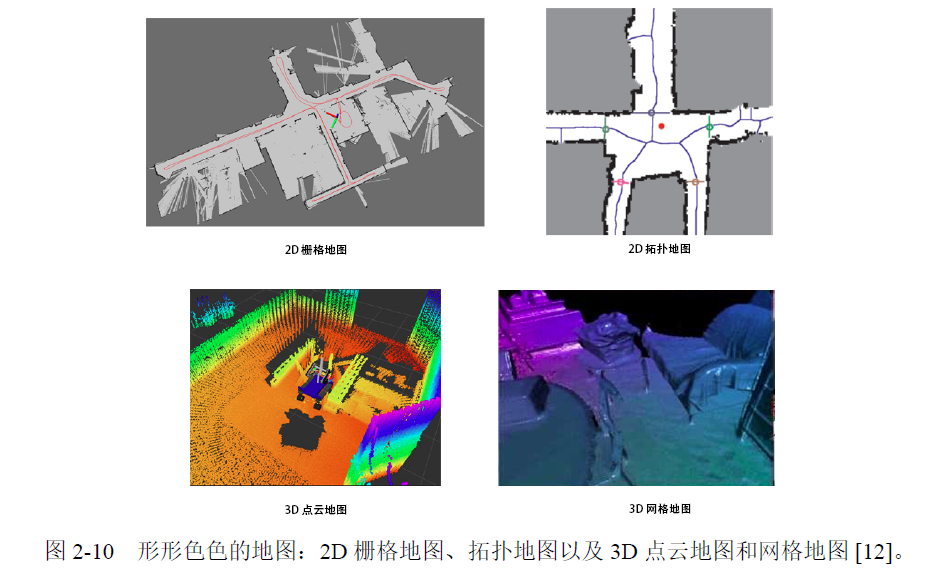
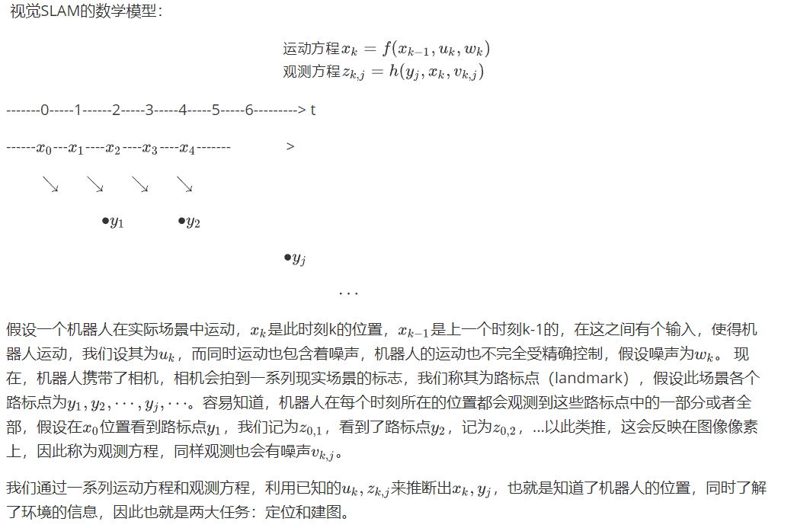
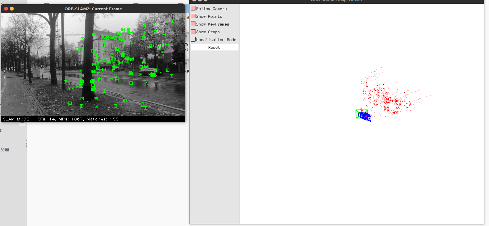

## 视觉SLAM概述

- simultaneous localization and mapping
- 仅使用相机进行室内/室外定位（有些情况下GPS会崩，IMU漂移随着时间误差增大）
- 机器人在未知环境进行导航---建图(sparse/semi-dense/dense)

------

学术上研究视觉SLAM较多，尤其是monocular，但是应用上少了点，尤其是建图的作用目前很浅，而且很多人大部分现在在用深度学习搞3D重建。目前应用的地方有：

- 手持设备定位
- 自动驾驶定位--比GPS的定位信息要丰富，甚至精度更好(可以达到厘米级)
- AR 增强现实（定位，建图，深度学习结合）
- 清洁机器人

------

<!--more-->

## 学习研究步骤

第一部分是学习相关的数学知识，构建数学模型

- 矩阵
- 概率论
- 李群李代数
- 微分几何
- 凸优化

...

第二部分是计算机视觉的代码实践

- openCV
- c++
- python
- Linux

...

教材：

- Multiple view  Geometry in computer vision
- State estimation for robotics
- 视觉SLAM十四讲-从理论到实践([作业代码](https://github.com/AceCoooool/slambook))

## 本教程内容提纲

- 概述与预备知识
- 三维空间的刚体运动
- 李群李代数
- 相机模型与非线性优化
- 特征点法视觉里程计
- 直接法视觉里程计
- 后端优化
- 回环检测

## 视觉SLAM的基本框架和模型

定位与建图是相互关联的，准确的定位需要精确的地图，精确的地图也来自准确的定位。

为什么选择视觉传感器: 携带安装更加自由，成本更低，信息丰富，功能不单一，可开发性强，智能化程度高具有挑战性（单目monocular/双目stereo/深度相机RGB-D/鱼眼、全景、event-based相机等），而挑战是普通的相机会丢失世界的距离信息，因此需要从图像中进行恢复（相机运动，相机几何关系，物理测量等）。

视觉SLAM框架

- 前端：visual odometry(估计邻帧相机相机运动/feature-based/direct-based)
- 后端：optimization(消除噪声，优化轨迹/最大后验概率估计/滤波器/图优化)
- 回环：loop closing(相机回到之前相同的位置，优化约束，消除累计误差/图像相似性/词袋模型)
- 建图：mapping(导航/路劲规划/人机交互/可视化/通讯/度量地图/拓扑地图/稀疏地图/稠密地图)





## 本次作业与实践

首先大致了解下Linux下编写C++源码以及利用cmake编译可执行文件的步骤

- 工具g++, cmake, VS code(optional IDE)
- 一个利用c++编写的简单工程包含着头文件文件夹incliude，源码文件夹src，cmake编译文件夹build，以及main.cpp和CMakeLists.txt等主要文件，其中CMakeLists.txt文件的语言格式要注意

```
cmake_minimum_required(VERSION 2.8)
project(HelloSLAM)

#指定程序编译的模式
set(CMAKE_BUILD_TYPE Debug)

#claim the include files' directories
include_directories("include")

# only src files
add_library(libHello src/hello.cpp)


add_executable(sayHello main.cpp)

target_link_libraries(sayHello libHello)
```

利用vs code配合cmake进行[配置](https://zhuanlan.zhihu.com/p/52874931)以进行代码的编写和调试，也可以选择KDEVELOP和其他的IDE。

### 熟悉LIinux

1.如何在 Ubuntu 中安装软件（命令⾏界⾯）？它们通常被安装在什么地⽅？

- apt-get 方式的安装；

普通安装：`sudo apt-get install XXX`

修复安装：`sudo apt-get -f install XXX`

重新安装：`sudo apt-get -f reinstall XXX`

- dpkg方式的安装

`sudo dpkg -i package_name.deb`

- 安装的地方

通常被安装在`/usr/bin`，`/usr/local`这个目录下

系统安装软件一般在`/usr/share`，可执行的文件在`/usr/bin`，配置文件可能安装到了`/etc`下等。文档一般在 `/usr/share`，可执行文件 `/usr/bin`，配置文件 `/etc`，lib文件 `/usr/lib。`

2.linux 的环境变量是什么？我如何定义新的环境变量？

- [Environment variables](http://pubs.opengroup.org/onlinepubs/009695399/basedefs/xbd_chap08.html) defined in this chapter affect the operation of multiple utilities, functions, and applications.

linux是一个多用户的操作系统。每个用户登录系统后，都会有一个专用的运行环境。通常每个用户默认的环境都是相同的，这个默认环境实际上就是一组环境变量的定义。用户可以对自己的运行环境进行定制，其方法就是修改相应的系统环境变量。环境变量是一个具有特定名字的对象，它包含了一个或者多个应用程序所将使用到的信息

常见的环境变量：

PATH：决定了shell将到哪些目录中寻找命令或程序

HOME：当前用户主目录

MAIL：是指当前用户的邮件存放目录。

SHELL：是指当前用户用的是哪种Shell。

HISTSIZE：是指保存历史命令记录的条数

LOGNAME：是指当前用户的登录名。

HOSTNAME：是指主机的名称，许多应用程序如果要用到主机名的话，通常是从这个环境变量中来取得的。

LANG/LANGUGE：是和语言相关的环境变量，使用多种语言的用户可以修改此环境变量。

 使用修改.bashrc文件进行环境变量的编辑，只对当前用户有用。

 使用修改/etc/profile文件进行环境变量的编辑，是对所有用户有用。

 关于环境变量命令介绍：

 echo显示某个环境变量值echo$PATH

 **export设置一个新的环境变量exportHELLO="hello"(可以无引号)**

 env显示所有环境变量

 set显示本地定义的shell变量

 unset清除环境变量unsetHELLO

 readonly设置只读环境变量readonlyHELLO


- 对所有用户生效的永久性变量（系统级）:

这类变量对系统内的所有用户都生效，所有用户都可以使用这类变量。作用范围是整个系统。

设置方式： 用vim在/etc/profile文件中添加我们想要的环境变量,用export指令添加环境变量

当然，这个文件只有在root（超级用户）下才能修改。我们可以在etc目录下使用ls -l查看这个文件的用户及权限

【注意】：添加完成后新的环境变量不会立即生效，除非你调用source /etc/profile 该文件才会生效。否则只能在下次重进此用户时才能生效。

- 对单一用户生效的永久性变量（用户级）:

只针对当前用户，和上面的一样，只不过不需要在etc下面进行添加，直接在.bash_profile文件最下面用export添加就好了。

这里 .bashrc和.bash_profile原则上来说设置此类环境变量时在这两个文件任意一个里面添加都是可以的。

~/.bash_profile是交互式login方式进入bash shell运行。

~/ .bashrc是交互式non-login方式进入bash shell运行。

二者设置大致相同。

就是.bash_profile文件只会在用户登录的时候读取一次

而.bashrc在每次打开终端进行一次新的会话时都会读取。

- 临时有效的环境变量（只对当前shell有效）:

此类环境变量只对当前的shell有效。当我们退出登录或者关闭终端再重新打开时，这个环境变量就会消失。是临时的。 直接使用export指令添加。


3.linux 根⽬录下⾯的⽬录结构是什么样的？⾄少说出 3 个⽬录的⽤途。

- 可通过终端查看/目录下的文件：

```
cd /
ls
```

`/bin `用户二进制文件
包含二进制可执行文件，系统所有用户可执行文件都在这个文件夹里，例如：ls，cp，ping等。

`/sbin` 系统二进制文件
包含二进制可执行文件，但只能由系统管理员运行，对系统进行维护。

`/etc `配置文件
包含所有程序配置文件，也包含了用于启动/停止单个程序的启动和关闭shell脚本。

`/dev `设备文件
包含终端所有设备，USB或连接到系统的任何设备。例如：`/dev/tty1`、`dev/usbmon0`

`/proc`进程信息
包含系统进程的相关信息。
这是一个虚拟的文件系统，包含有关正在运行的进程的信息。例如：`/proc/{pid}`目录中包含的与特定pid相关的信息。
这是一个虚拟的文件系统，系统资源以文本信息形式存在。例如：`/proc/uptime`

`/var `变量文件
可以找到内容可能增长的文件。
这包括 - 系统日志文件`/var/log`;包和数据库文件`/var/lib`;电子邮件`/var/mail`;打印队列`/var/spool`;锁文件`/var/lock`;多次重新启动需要的临时文件`/var/tmp`;

`/tmp `临时文件
包含系统和用户创建的临时文件。
当系统重新启动时，这个目录下的文件都将被删除。

`/usr `用户程序
包含二进制文件、库文件、文档和二级程序的源代码。
`/usr/bin`中包含用户程序的二进制文件。如果你在`/bin`中找不到用户二进制文件，到`/usr/bin`目录看看。例如：at、awk、cc、less、scp。
`/usr/sbin`中包含系统管理员的二进制文件。如果你在`/sbin`中找不到系统二进制文件，到`/usr/sbin`目录看看。例如：atd、cron、sshd、useradd、userdel。
`/usr/lib`中包含了`/usr/bin`和`/usr/sbin`用到的库。
`/usr/local`中包含了从源安装的用户程序。例如，当你从源安装Apache，它会在`/usr/local/apache2`中。

`/home` HOME目录
所有用户用来存档他们的个人档案。

`/boot `引导加载程序文件
包含引导加载程序相关的文件。
内核的initrd、vmlinux、grub文件位于`/boot`下。

`/lib `系统库
包含支持位于`/bin`和`/sbin`下的二进制文件的库文件.
库文件名为 ld或lib.so.*

`/opt `可选的附加应用程序
opt代表opitional；
包含从个别厂商的附加应用程序。
附加应用程序应该安装在`/opt/`或者`/opt/`的子目录下。

`/mnt `挂载目录
临时安装目录，系统管理员可以挂载文件系统。

`/media` 可移动媒体设备
用于挂载可移动设备的临时目录。
举例来说，挂载CD-ROM的`/media/cdrom`，挂载软盘驱动器的`/media/floppy`;

`/srv`服务数据
srv代表服务。
包含服务器特定服务相关的数据。
例如，`/srv/cvs`包含cvs相关的数据。


4.假设我要给 a.sh 加上可执⾏权限，该输⼊什么命令？

`chmod 777 文件名` 将文件设置成对拥有者、组成员、其他人可读、可写、可执行。
`chmod a+x 文件名`将文件在原来的配置上增加可执行权限。


5.假设我要将 a.sh ⽂件的所有者改成 xiang:xiang，该输⼊什么命令？

`chown xiang:xiang 文件名`将文件的所有者改成xiang:xiang


### SLAM文献阅读

1.SLAM 会在哪些场合中⽤到？⾄少列举三个⽅向。

机器人定位导航、手持设备定位、增强现实、自动泊车、语义地图重建等


2.SLAM中定位与建图是什么关系？为什么在定位的同时需要建图？

定位需要精确的地图，详细的地图需要精确地定位，两者相辅相成，相互依存。重定位和局部建图是slam框架中很重要的两个线程。

定位：机器人必须**知道自己在环境中位置**；

建图：机器人必须**记录环境中特征的位置**（如果知道自己的位置）；

机器人在未知环境中从一个未知位置开始移动,在移动过程中根据位置估计和地图进行自身定位,同时在自身定位的基础上建造增量式地图，实现机器人的自主定位和导航。


3.SLAM发展历史如何？我们可以将它划分成哪⼏个阶段？

1985-1990：, Chatila 和Laumond (1985) and Smith et al. (1990)提出以建图和定位同时进行；

**单传感器为外部传感器：**

早期：

- 声呐(Tardós et al. 2002; Ribas et al. 2008)；

后期：

- 激光雷达(Nüchter etal. 2007; Thrun et al. 2006)；
- 相机(Se et al. 2005; Lemaire et al. 2007; Davison 2003;Bogdan et al. 2009)；
- GPS(Thrun et al. 2005a)；

**多传感器融合**

三个发展阶段：

- 初始阶段：二十世纪八十年代
- 发展阶段：二十世纪九十年代
- 快速发展阶段


4.列举三篇在SLAM领域的经典⽂献。

- Smith, R.C. and P. Cheeseman, On the Representation and Estimation of Spatial Uncertainty. International Journal of Robotics Research, 1986. 5
- Se, S., D. Lowe and J. Little, Mobile robot localization and mapping with uncertainty using scale­invariant visual landmarks. The international Journal of robotics Research, 2002. 21
- Mullane, J., et al., A Random­Finite­Set Approach to Bayesian SLAM. IEEE Transactions on Robotics, 2011


### CMake练习

在自己的工程目录里面建立子目录`build`文件夹和`src`文件夹和`libhello`文件夹，hello.cpp,hello.h放入`libhello`中,useHello.cpp放入`src`中。同时在工程目录下创建一个顶层的CMakeLists.txt文件，内容如下：

```
project(sayHello)

cmake_minimum_required(VERSION 2.8)

#ADD_SUBDIRECTORY(source_dir [binary_dir] [EXCLUDE_FROM_ALL])
#这个指令用于向当前工程添加存放源文件的子目录，并可以指定中间二进制和目标二进制存放的位置
add_subdirectory(src) 
#在 build 目录中将出现一个 src 目录，生成的目标代码 hello 将存放在 src 目录中

add_subdirectory(libhello)

set(CMAKE_BUILD_TYPE "Release")
```

在`src`文件夹下新建CMakeLists.txt文件，输入如下内容：

```
cmake_minimum_required(VERSION 2.8)

#头文件目录
include_directories(${PROJECT_SOURCE_DIR}/libhello)

set(APP_SRC useHello.cpp)

#指定最终的目标二进制的位置
#SET(EXECUTABLE_OUTPUT_PATH ${PROJECT_BINARY_DIR}/bin)
#SET(LIBRARY_OUTPUT_PATH ${PROJECT_BINARY_DIR}/lib)
set(EXECUTABLE_OUTPUT_PATH ${PROJECT_BINARY_DIR}/bin)

add_executable(sayHello ${APP_SRC})

#为 target 添加需要链接的库
target_link_libraries(sayHello libhello)
```

最后在`libhello`文件夹下新建CMakeLists.txt文件，输入如下内容：

```
cmake_minimum_required(VERSION 2.8)

set(LIB_SRC hello.cpp)

#向 C/C++编译器添加-D 定义
add_definitions("-DLIBHELLO_BUILD")

#添加动态库
add_library(libhello SHARED ${LIB_SRC})
#设置动态库输出位置
set(LIBRARY_OUTPUT_PATH ${PROJECT_BINARY_DIR}/lib)

#SET_TARGET_PROPERTIES(target1 target2 ...
#PROPERTIES prop1 value1 
#prop2 value2 ...)
#该指令可以用来设置输出的名称，对于动态库，还可以用来指定动态库版本和 API 版本
set_target_properties(libhello PROPERTIES OUTPUT_NAME "sayhello")
```

接着在`build`文件夹下`cmake ..`, `make`即可，在biuld文件中的子问夹下的bin文件生成可执行文件sayHello;在lib中生成库文件libhello.so共享库文件。

对于安装路径，可以使用`CMAKE_INSTALL_PREFIX`命令。


### 理解ORBSLAM2框架

1.`git clone https://github.com/raulmur/ORB_SLAM2`


2.(a) 6个可执行文件一个库文件 `set(CMAKE_LIBRARY_OUTPUT_DIRECTORY ${PROJECT_SOURCE_DIR}/lib)`

   (b)`include`文件夹包含：对应`src`中程序的代码函数头文件；`src`文件夹包含：相应程序的代码函数的c++文件；Examples文件夹包含RGB-D文件夹，Stereo文件夹， Monocular文件夹，具体的内容在总目录下的CMakeLists.txt文件中有写：

```
# Build examples

set(CMAKE_RUNTIME_OUTPUT_DIRECTORY ${PROJECT_SOURCE_DIR}/Examples/RGB-D)

add_executable(rgbd_tum
Examples/RGB-D/rgbd_tum.cc)
target_link_libraries(rgbd_tum ${PROJECT_NAME})

set(CMAKE_RUNTIME_OUTPUT_DIRECTORY ${PROJECT_SOURCE_DIR}/Examples/Stereo)

add_executable(stereo_kitti
Examples/Stereo/stereo_kitti.cc)
target_link_libraries(stereo_kitti ${PROJECT_NAME})

add_executable(stereo_euroc
Examples/Stereo/stereo_euroc.cc)
target_link_libraries(stereo_euroc ${PROJECT_NAME})


set(CMAKE_RUNTIME_OUTPUT_DIRECTORY ${PROJECT_SOURCE_DIR}/Examples/Monocular)

add_executable(mono_tum
Examples/Monocular/mono_tum.cc)
target_link_libraries(mono_tum ${PROJECT_NAME})

add_executable(mono_kitti
Examples/Monocular/mono_kitti.cc)
target_link_libraries(mono_kitti ${PROJECT_NAME})

add_executable(mono_euroc
Examples/Monocular/mono_euroc.cc)
target_link_libraries(mono_euroc ${PROJECT_NAME})
```

   (c) OPENCV_LIBS、EIGEN3_LIBS、Pangolin_LIBRARIES、/ORB-SLAM2/Thirdparty/DBoW2/lib/libDBoW2.so、/ORB-SLAM2/Thirdparty/g2o/lib/libg2o.so


### 运行ORB-SLAM2

1.编译安装依赖项，可以按照[ORB-SLAM2源码](https://github.com/raulmur/ORB_SLAM2)的指导进行配置。其他依赖项按照高翔书中所说的安装

```
sudo apt-get install libopencv-dev libeigen3-dev libqt4-dev qt4-qmake libqglviewer-dev libsuitesparse-dev libcxsparse3.1.2 libcholmod[tab安装]
```

其中需要注意Pangolin需要下载手动编译安装，步骤比较简单，不再赘述

```
sudo apt-get install libglew-dev
---
sudo apt-get install libboost-dev libboost-thread-dev libboost-filesystem-dev
---
git clone https://github.com/stevenlovegrove/Pangolin Pangolin
--
cd Pangolin
mkdir build
cd build
cmake ..
make 
sudo make install
---
```

另外一个注意的点就是opencv库，我是手动下载编译安装的，网上的教程很多，主要是编译时注意cmake的设置，但是我在安装的时候无法被python链接，也就是没有生成cv2.so，导致没办法在Python2和python3中`import cv2`，估计可能是我之前先装了anaconda的原因，导致了opencv编译忽略了Python路径问题。。。尝试了几次，未果，等以后用到了python再解决这个问题（可以直接用`sudo pip3 install opencv-python`，如果不想麻烦的话，不过以后可能会出现一些问题）

2.如何将 myslam.cpp或 myvideo.cpp 加⼊到 ORB-SLAM2 ⼯程中？请给出你的 CMakeLists.txt 修改⽅案。

```
#add myvideo.cpp and myslam.cpp
set(CMAKE_RUNTIME_OUTPUT_DIRECTORY ${PROJECT_SOURCE_DIR})

add_executable(myvideo myvideo.cpp)
target_link_libraries(myvideo ${PROJECT_NAME})

add_executable(myslam myslam.cpp)
target_link_libraries(myslam ${PROJECT_NAME})
```

**将myvideo.cpp、myslam.cpp、myvideo.yaml、myslam.yaml以及myvideo.mp4都放到ORB-SLAM2目录下**，再次编译ORB-SLAM2后，就会生成可执行文件，然后终端输入./myvideo和./myslam就可以直接运行了。(没有视频可以自己拍）



这里有个问题，一开始我是根据CMakeLits.txt中上面的语句来写的，也就是我把myvideo.cpp、myslam.cpp放在了、Examples/Monocular文件夹中，然后进行编译，结果虽然生成了可执行文件，但是程序无法运行，终端要么提示无法读取对应的.yaml的设置，要么出现segmentation fault错误，最后放到ORB-SLAM2总目录下就没问题了。。。目前不知道什么原因，等后面再看看。

------

------

因为ORB-SLAM2开源的版本没有稠密建图功能，因此如果想尝试稠密建图功能，可以参考高翔博士的ORB-SLAM2_modofied，利用PCL工具实时拼接RGB-D图像，效果还可以，不过没有原作者视频中最后的那个效果好，安装步骤在[这里](https://github.com/Richardyu114/ORBSLAM2_with_pointcloud_map-in-Ubuntu-16.04)。
